<p align="center">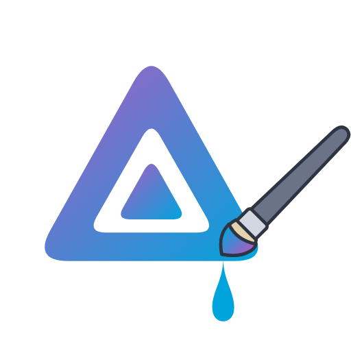</p>

<p align="center">
  <a href="https://jellycanvas.jellyscope.cz"></a>
</p>

# Jellycanvas

A theme designer for **Jellyfin 12**, delivered as a server plugin. Pick
colors, bar layouts and styles, card effects, fonts and dozens of other
options in the Dashboard, watch a live preview of the real web client for
the web, TV and mobile layouts, and apply with one click.

The output is **plain CSS** written to *Dashboard → General → Branding →
Custom CSS* - the same place you would paste a hand-written theme. Nothing
else in Jellyfin is touched; uninstalling leaves a server that behaves
exactly as before. A few features that CSS cannot do (custom toolbar
buttons, a home slideshow, card badges, a closable info bar) come from a
small client script injected through the
[File Transformation](https://github.com/IAmParadox27/jellyfin-plugin-file-transformation)
plugin when it is installed.

> Requires Jellyfin **12.0** or newer. The theme reaches every client that
> renders the web UI: browsers, Jellyfin Media Player, the Android app and
> the web UI's TV layout (a browser or WebOS / Tizen app). Native apps
> (Android TV, Swiftfin, Roku, Kodi) do not load custom CSS.

## Screenshots

The designer: settings on the left, the live preview of the real web
client on the right. Everything shown is made-up demo data: a test
library of short generated clips with public posters, invented
requests and users, and a stand-in Seerr - no real server behind it.

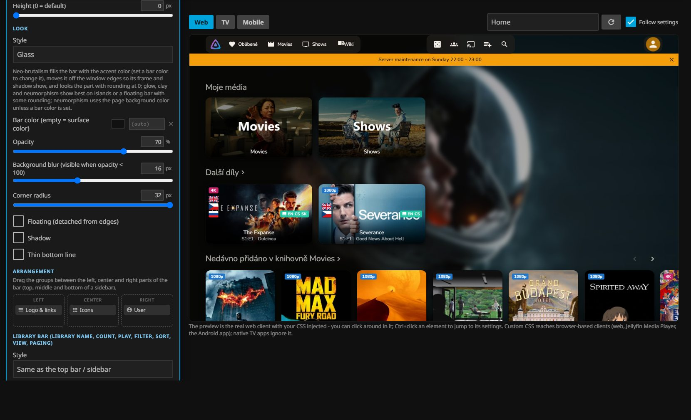

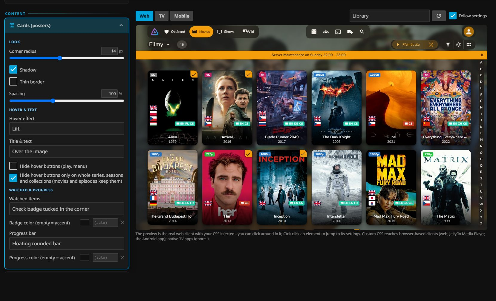

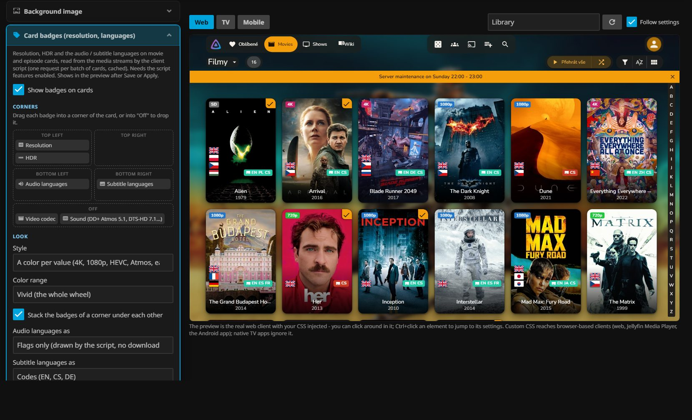

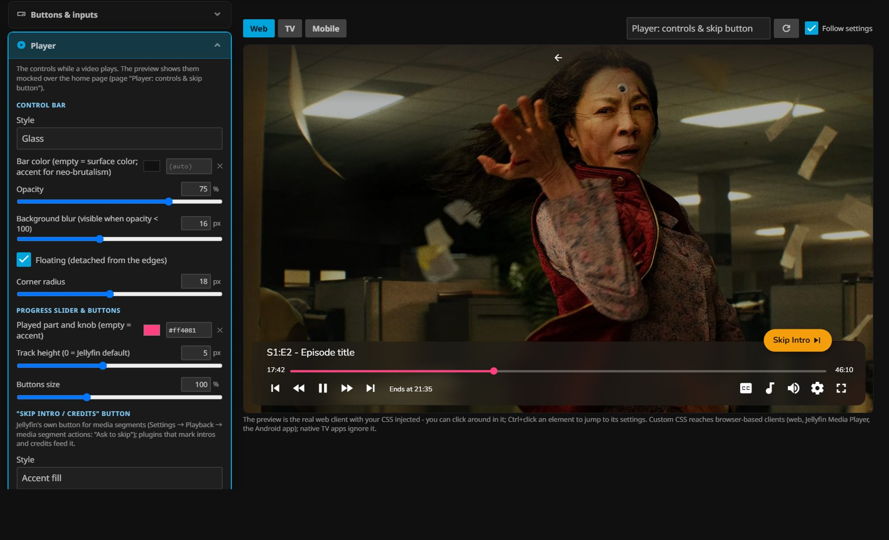

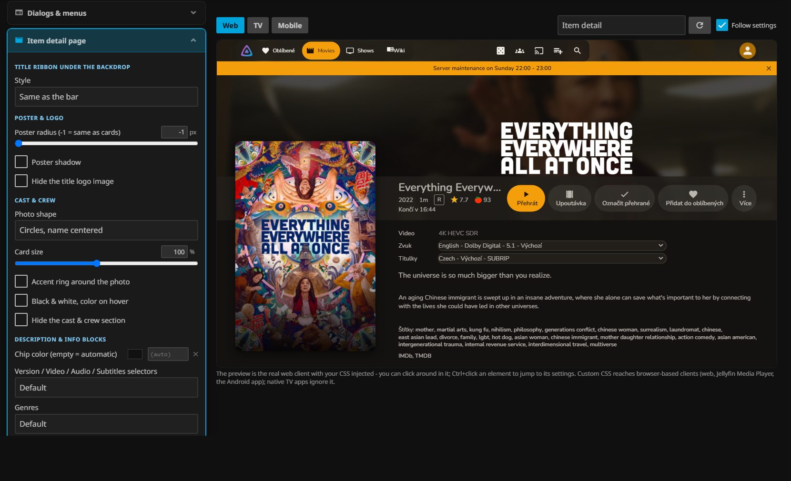

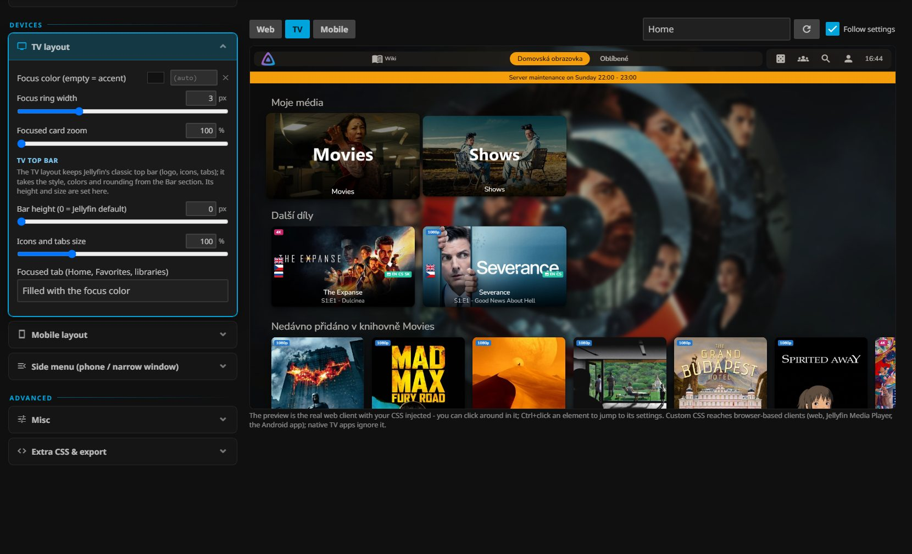

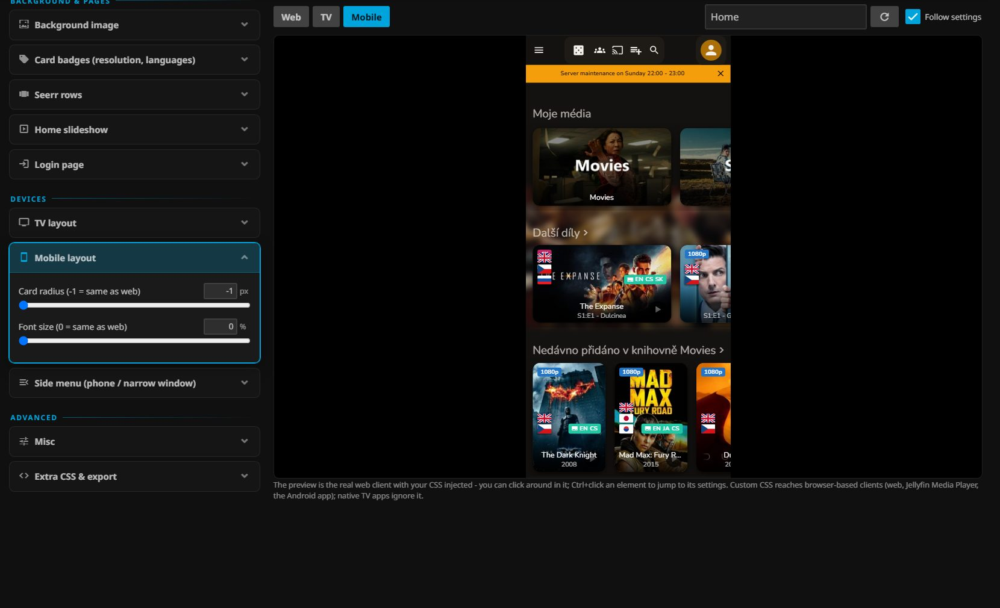

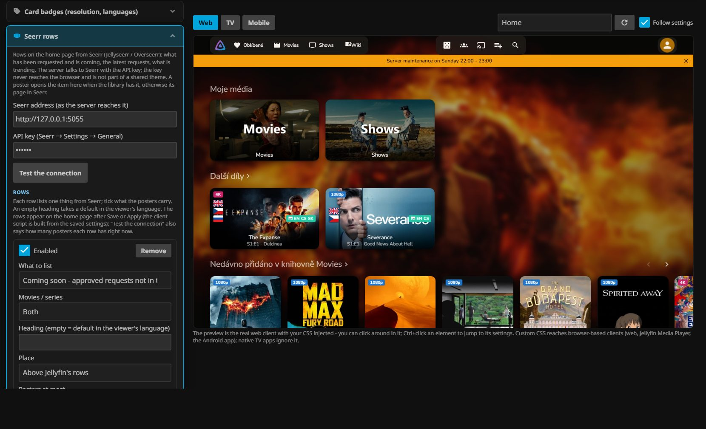

What it looks like in the client:

| Home | Library |
|---|---|
| 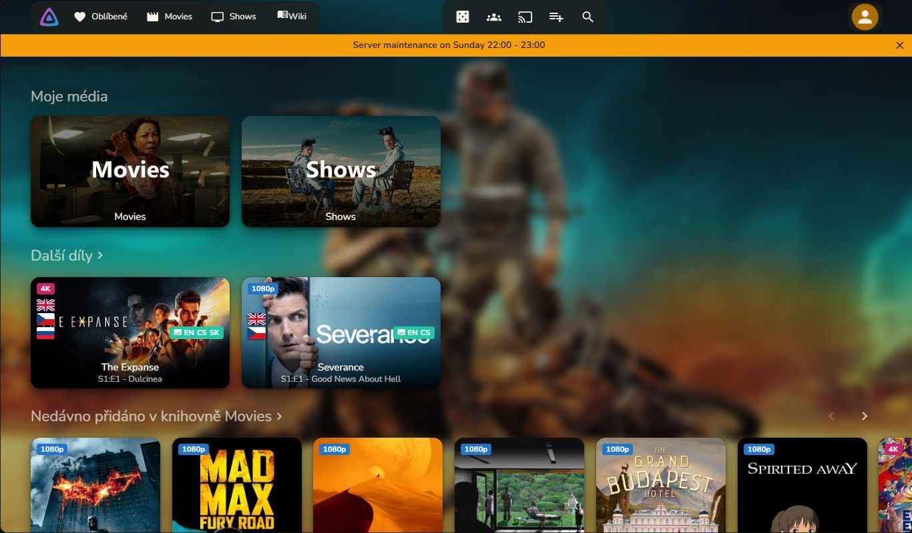 | 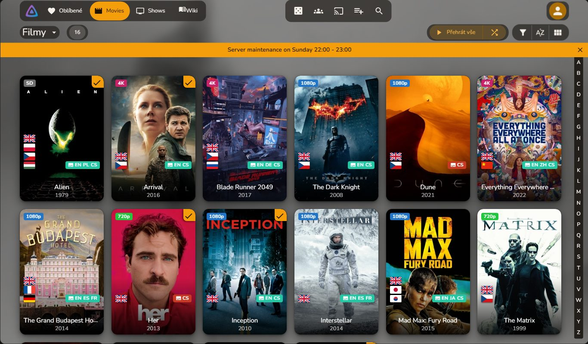 |

| Item page | Player |
|---|---|
| 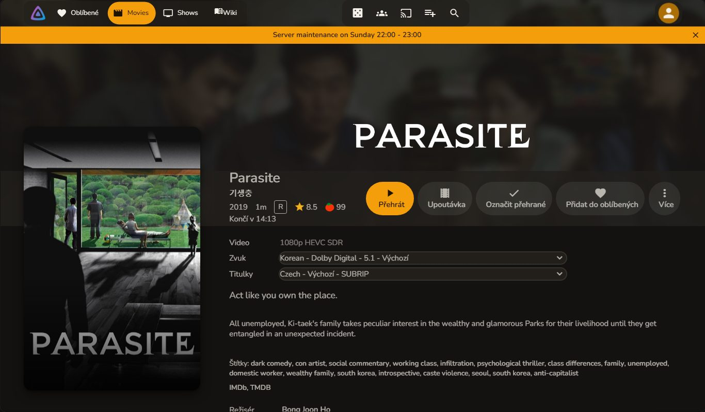 | 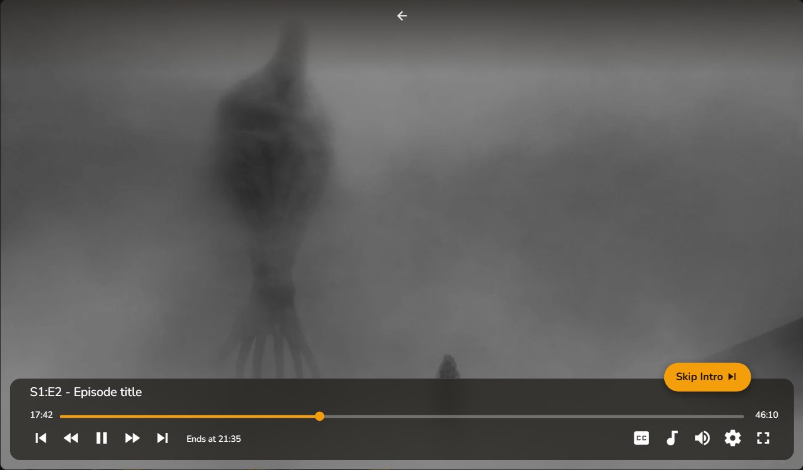 |

| TV | Phone |
|---|---|
| 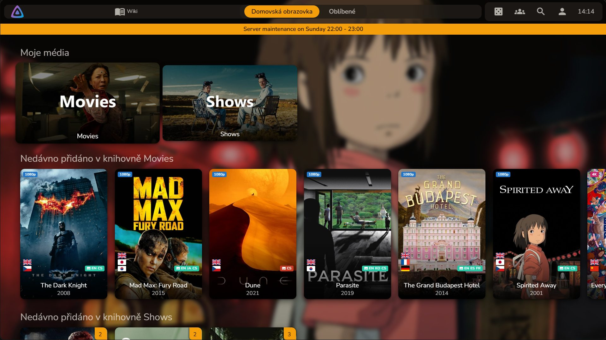 | 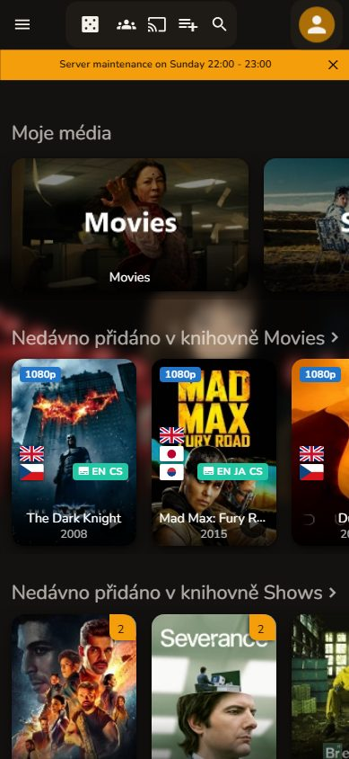 |

## Installation

### From the plugin repository (recommended)

1. In Jellyfin open *Dashboard → Plugins → Repositories* and add:

   ```
   https://raw.githubusercontent.com/SpeeDFireCZE/jellycanvas/main/manifest.json
   ```

   Name it "Jellycanvas" (the name is only shown to you).
2. Go to *Catalog*, find **Jellycanvas** under *General* and install it.
3. Restart Jellyfin.
4. Open *Dashboard → My Plugins → Jellycanvas*.

Updates appear in the catalog like any other plugin.

### Manually

1. Download `jellycanvas_<version>.zip` from the
   [releases page](https://github.com/SpeeDFireCZE/jellycanvas/releases).
2. Unpack it into a `Jellycanvas` folder inside your server's plugin
   directory:
   - Linux: `/var/lib/jellyfin/plugins/Jellycanvas/`
   - Docker: `<config volume>/plugins/Jellycanvas/`
   - Windows: `%ProgramData%\Jellyfin\Server\plugins\Jellycanvas\`
3. Restart Jellyfin.

### Optional: script features

Custom toolbar buttons, the home slideshow, card badges (resolution,
languages) and the info bar's close button need JavaScript in the web
client. Install the **File Transformation** plugin (available in its own
repository, see its README) and the script is injected automatically once
you apply the theme. The sections that need it stay hidden in Jellycanvas
until such a plugin is present. One caveat that applies to every File
Transformation based plugin: browsers cache `index.html`, so hard-refresh
(Ctrl+F5) once after enabling the script features.

## Using it

Everything happens on the plugin page. The left side holds the settings,
grouped as *Start / Bars & navigation / Content / Background & pages /
Devices / Advanced*; the right side is a live preview of the real web
client with your theme injected.

- **Presets** give a starting point (stock Jellyfin, frosted glass, soft
  & rounded, neon night, minimal).
- **Preview** - switch between web, TV and mobile, and between the pages
  where a setting shows (home, library, item detail, login, the player's
  "Up next" and "Still watching?" prompts). *Follow settings* switches the
  page automatically. **Ctrl+click** (Cmd+click) on anything in the
  preview jumps to the setting that controls it.
- **Save draft** keeps your work in the plugin without touching the
  server; nobody else sees it. **Apply to server** writes the CSS to
  Branding for everyone. **Remove from server** takes it out again; your
  settings stay saved.
- **Share / import** exports the theme as a JSON file and loads one back
  in - pasted, opened from a file or fetched from a link (a raw GitHub
  file, for example). The export holds only the look: custom buttons and
  their addresses, the info bar text, the login title, the uploaded logo
  and image links on private addresses never leave your server. Ready-made
  themes are at **[jellycanvas.jellyscope.cz](https://jellycanvas.jellyscope.cz)**
  (see below) - the file you download there is imported the same way.

A server upgraded from Jellyfin 10.x can be left with old theme files
(`web/themes/*/theme.css`) that ignore the theme's variables. Jellycanvas
compensates in its own CSS; *Misc → Theme files on the server* shows which
files are old and can patch them, though reinstalling `jellyfin-web` is
the proper fix.

Custom CSS you had in Branding before is preserved: the generated block
sits between two marker comments, and the plugin never touches anything
outside them.

The web client caches the branding for up to a minute, so after *Apply*
other browsers may need a reload a little later.

## Themes to share

Themes made with the designer can be shared at
**[jellycanvas.jellyscope.cz](https://jellycanvas.jellyscope.cz)**.

- **Browsing, previewing and downloading is open to everyone** - no
  account needed. Each theme has screenshots of the real client, so you
  can see what it does before you take it.
- **Uploading needs an account** on the site (that is all an account is
  for).

A theme is the same JSON the plugin's *Share / import* section produces,
so the way there and back is: export in the designer, upload on the site
- and download a theme, then import it in *Share / import* and apply.

## What can be customized

- **Colors** - accent, background, surfaces, text, the frame color of
  neo-brutalist surfaces.
- **Bar** - one full-width top bar, a top bar split into islands, or a
  vertical sidebar on the left (optionally collapsible, sliding out on
  hover); solid, glass, gradient, transparent, neo-brutalism,
  glowmorphism, claymorphism or neumorphism, with opacity, blur, rounding,
  floating, shadow; drag the logo + links, icons and user groups between
  the parts of the bar; navigation links as text, pills or underline; hide
  the SyncPlay / Cast / Search icons; the library row (title, sort,
  filter, view) with its own look next to a sidebar.
- **Logo** - Jellyfin icon, a custom image (URL or upload), server name.
- **Info bar** - an announcement strip at the top or bottom, with an
  optional close button (script).
- **Cards** - rounding, hover effect, shadow, border, title placement,
  spacing; watched items as a badge, corner badge, dimmed or black &
  white poster; progress as a thin line, floating bar, bold bar, top line
  or a translucent fill over the poster; hover buttons off everywhere or
  only on series, seasons and collections.
- **Card badges** (script) - resolution, HDR, codec, sound, audio and
  subtitle languages (flags or codes, preferred languages first, at most
  1-4) in the corners of movie and episode cards; dark, accent, glass, or
  a color per value from a chosen range.
- **Seerr rows** (script) - rows on the home page from Jellyseerr /
  Overseerr: coming soon (requested), recently requested, waiting for
  approval, now available, trending, popular movies and series.
- **Player** - the control bar, the progress slider, button size and the
  "Skip intro / credits" button.
- **Buttons & inputs**, **dialogs & menus** (and the player's "Up next"
  prompt), **item detail page** (title ribbon, poster, cast & crew as
  circles or squares, selectors / genres / tags / links as chips, section
  titles, hide sections), **background image** (random backdrop from the
  library, rotating every N seconds, custom URL, blur, dim, panning),
  **home slideshow** (script), **login page** (background image or
  gradient, form as card or glass, field and button styles, texts),
  **typography** (bundled, system, Google Fonts), **TV** (the TV layout's
  own top bar takes the bar settings, plus its height and icon size, the
  focused tab's look, focus ring, card zoom) and **mobile** tweaks, and a
  free-form extra CSS box.

## Development

Requirements: .NET 10 SDK (Jellyfin 12 runs on .NET 10). For the local test
instance: Windows PowerShell 5.1 or later and a portable Jellyfin 12
(`jellyfin_12.x-amd64.zip` from
<https://repo.jellyfin.org/files/server/windows/latest-stable/amd64/>,
unpacked into `test\jellyfin\`).

```
dotnet build                      # plugin + tests
dotnet test                       # CssBuilder / BrandingWriter / ScriptBuilder unit tests
.\test\Start-Jellyfin.ps1         # build, install into test\data\plugins, start the server
.\test\Setup-Jellyfin.ps1         # first run only: wizard, admin/admin, test libraries
.\test\Make-Media.ps1             # optional: test clips with resolutions, HDR, languages, subtitles
```

The test server keeps everything under `test\data\` (git-ignored). Log in
as `admin` / `admin` and open *Dashboard → My Plugins → Jellycanvas*.

### Layout

```
Jellyfin.Plugin.Jellycanvas/
  Plugin.cs                      plugin entry point, registers the pages
  Configuration/
    PluginConfiguration.cs       the settings model (= one theme)
    configPage.html              the designer page (markup + layout CSS)
    configPage.js                the designer logic (bindings, preview, apply)
  Theme/
    CssBuilder.cs                settings → CSS
    BrandingWriter.cs            CSS → Branding.CustomCss, between markers
    Presets.cs                   starting-point themes
    Color.cs                     small color math (mix, contrast, channels)
  Api/
    JellycanvasController.cs     /Jellycanvas/{Status,Presets,Preview,Apply,Save,Disable,Logo,Backdrop,Script.js}
  Scripts/
    inject.js                    the client script template
    ScriptBuilder.cs             bakes the configuration into the template
    FileTransformation.cs        registers the index.html patch with File Transformation
Jellyfin.Plugin.Jellycanvas.Tests/   xunit tests for the pure parts
test/                            scripts for the local Jellyfin 12 instance
build.yaml                       plugin manifest (JPRM format)
manifest.json                    the plugin repository served from this repo
scripts/update-manifest.py       adds a release to manifest.json (used by CI)
```

### Releasing

1. Bump the version in `build.yaml` and in the `.csproj`
   (`AssemblyVersion` / `FileVersion`), move the *Unreleased* notes in
   `CHANGELOG.md` under the new version, commit.
2. Tag it: `git tag 1.2.3 && git push --tags` (the tag must equal the
   version in `build.yaml`).
3. The *Release* workflow builds the plugin, attaches
   `jellycanvas_1.2.3.zip` to a GitHub release and adds the version to
   `manifest.json` on `main` - Jellyfin servers with the repository added
   see the update in their catalog.

## License

Copyright (c) 2026 SpeeDFireCZE. Jellycanvas is free software under the
**GNU Affero General Public License v3.0** - see [LICENSE](LICENSE). In
short: use it, change it, share it, but publish the source of your changes
under the same license, also when you only run a modified version for
others over a network.
